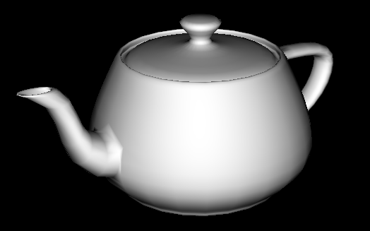
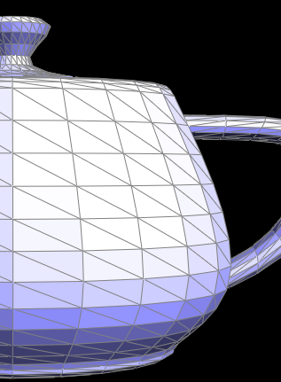

# Assignment 05

Name: An Zihang

Student ID: 121090001

## 0. Abstract

This project involves some geometric topics, like Bezier Curves and surfaces, operations on triangle meshes, and upsampling based on Loop Subdivision.

## 1. Part I: Bezier Curves and Surfaces

### 1.1 Task 1: Bezier Curves with 1D de Casteljau Subdivision

Bezier Curve is a kind of curve generated with several control points. And doing affine transformation to the curve is equivalent to doing the same transformations to the control points.

Casteljau algorithm is a way to generate Bezier Curves recursively. $n$ control points can form a "chain" with $n$ nodes. For each point on the Bezier Curve, we can map it with a unique real number $t\in [0,1]$, so than we can pick $n-1$ points on the $n-1$ "chain links" (more specifically, the point at the $100t\%$ length of each chain link) to form a new chain. Going on recursively, we can reduce the number of chain nodes to 1, which is the point on the Bezier Curve with parameter $t$.

For one step of the recursive process, assume we have got a list of $k$ control points and a parameter $t$, we want to lower the size of the point set. So from point 0 to point $k$, we pick one point between adjacent points. The position of the points are obtained by interpolation using t:

```c++
std::vector<Vector2D> BezierCurve::evaluateStep(std::vector<Vector2D> const &points)
{ 
    // TODO Task 1.
    if (points.size() == 1)
        return points;

    std::vector<Vector2D> res;
    for (int i = 0; i < points.size()-1; i++) {
        double nx = points[i].x * (1-t) + points[i+1].x * t;
        double ny = points[i].y * (1-t) + points[i+1].y * t;
        res.push_back(Vector2D(nx, ny));
    }
    return res;
}
```

After $k-1$ steps, the control point set will be reduced to one, and we find a point on the Bezier Curve.

The following images are an example of the algorithm:


### 1.2 Task 2: Bezier Surfaces with Separable 1D de Casteljau

When it comes to a 2D condition, doing de Casteljau on one dimension is not enough. But we can treat the two dimensions separately, i.e. we can do de Casteljau with parameter $u$ for one dimension to get a series of points, and do Casteljau to these points with the other parameter $v$ to obtain a single point on the Bezier Surface.

We need to firstly know how to evaluate a point for one dimension.

```c++
std::vector<Vector3D> BezierPatch::evaluateStep(std::vector<Vector3D> const &points, double t) const
{
    // TODO Task 2.
    if (points.size() == 1)
        return points;

    std::vector<Vector3D> res;
    // very similar to the Bezier Curve evaluation
    for (int i = 0; i < points.size()-1; i++) { 
        double nx = points[i].x * (1-t) + points[i+1].x * t;
        double ny = points[i].y * (1-t) + points[i+1].y * t;
        double nz = points[i].z * (1-t) + points[i+1].z * t;
        res.push_back(Vector3D(nx, ny, nz));
    }
    return res;
}

Vector3D BezierPatch::evaluate1D(std::vector<Vector3D> const &points, double t) const
{
    // TODO Task 2.
    std::vector<Vector3D> res = points;
    while (res.size() > 1)
        res = evaluateStep(res, t);

    return res[0];
}
```

Then we evaluate the point on the surface:

```c++
Vector3D BezierPatch::evaluate(double u, double v) const 
{  
    // TODO Task 2.
    Vector3D res = Vector3D();
    std::vector<Vector3D> columnPoints;
    for (int i = 0; i < controlPoints.size(); i++) {
        Vector3D colPoint;
        colPoint = evaluate1D(controlPoints[i], u);
        columnPoints.push_back(colPoint);
    }
    res = evaluate1D(columnPoints, v);
    return res;
}
```

It is easy to see that every point on the surface takes much computation, and modifying any control point will result in the reshape of the whole surface, which may be the reason why Bezier Surface is hard to render and often replaced by triangle meshes.

The following image is an example of Bezier Surface:


## 2. Part II: Triangle Meshes and Half-Edge Data Structure

Half-Edge Data Structure stores key information in the half edges (single-direction edges). The other mesh elements (vertices, triangle faces, edges) are all uniquely determined by half edges. In that case, the operations to the meshes can be achieved by modifying the half edges and mapping relationship between mesh elements.

### 2.1 Task 3: Area-Weighted Vertex Normals

To smooth the shading of the meshes, we need to use Phong shading, so we need to compute the normal at each vertex. The normal is obtained by the Area-Weighted average of the face normals around the vertex.

Area of the surrounding triangles can be obtained via vector crossing, so we just need to traverse the half edges originated at the vertex.

```c++
Vector3D Vertex::normal( void ) const
{
    // TODO Task 3.
    // Returns an approximate unit normal at this vertex, computed by
    // taking the area-weighted average of the normals of neighboring
    // triangles, then normalizing.
    Vector3D res = Vector3D(0., 0., 0.);

    HalfedgeCIter h = this->halfedge();
    do {
        if (!h->face()->isBoundary()) {
            double area = 0.;
            Vector3D v1 = Vector3D(h->next()->vertex()->position         - this->position);
            Vector3D v2 = Vector3D(h->next()->next()->vertex()->position - this->position);
            area = 0.5 * cross(v1, v2).norm(); // compute the area via vector cross
            res += area * h->face()->normal();
        }
        h = h->twin()->next(); // go to the next halfedge originated at the same vertex
    } while (h != this->halfedge());

    return res.unit(); // normalize
}
```

With vertex normals, the surface looks much more smooth:




### 2.2 Task 4: Edge Flip

Task 4 and 5 serves task 6, which is the Loop Subdivision. To flip an edge between two triangles, we have to modify several mapping relationships (e.g. the $next,\ face$ properties of half edges and the $halfedge$ binding of vertices and half edges).

To prevent omission of modification and thus faulty flip, it is better to declare pointers to each mesh element and consider whether it has modified properties.

In task 4, 5, 6, the pointer names follow this naming rule:

| First character | Element type |
| --------------- | ------------ |
| h               | half edge    |
| f               | face         |
| v               | vertex       |
| e               | edge         |

Originally, the mesh may look like this:


Assume the flipping operation rotates e0 counterclockwise. The mesh may look like this after flipping:


These mesh elements might have modified properties:

| Element | Modified properties | Before (possibly) | After    |
| ------- | ------------------- | ----------------- | -------- |
| f0      | halfedge            | h02               | h0       |
| f1      | halfedge            | h12               | h1       |
| v0      | halfedge            | h0                | h11      |
| v1      | halfedge            | h1                | h01      |
| h0      | next, vertex        | h01, v0           | h12, v02 |
| h01     | next                | h02               | h0       |
| h02     | face                | f0                | f1       |
| h1      | next, vertex        | h11, v1           | h02, v12 |
| h11     | next                | h12               | h1       |
| h12     | face                | f1                | f0       |

The settings are arranged clearly in the code:

```cpp
EdgeIter HalfedgeMesh::flipEdge( EdgeIter e0 )
{
    // TODO Task 4.
    // This method should flip the given edge and return an iterator to the flipped edge.
    if (e0->isBoundary())
        return e0;
    HalfedgeIter h0 = e0->halfedge(),
    h1 = h0->twin(),
    h01 = h0->next(),
    h02 = h01->next(),
    h11 = h1->next(),
    h12 = h11->next();
    VertexIter v0 = h0->vertex(),
    v1 = h1->vertex(),
    v02 = h02->vertex(),
    v12 = h12->vertex();
    FaceIter f0 = h0->face(),
    f1 = h1->face();

    // Face settings
    f0->halfedge() = h0;
    f1->halfedge() = h1;

    // Vertex settings
    v0->halfedge() = h11;
    v1->halfedge() = h01;

    // Halfedge settings
    //   setNeighbors(next, twin,       vertex, edge,        face)
    // For h0 triangle
    h0-> setNeighbors(h12, h1,          v02,    e0,          f0);
    h01->setNeighbors(h0,  h01->twin(), v1,     h01->edge(), f0);
    h02->setNeighbors(h11, h02->twin(), v02,    h02->edge(), f1);
    // For h1 triangle
    h1-> setNeighbors(h02, h0,          v12,    e0,          f1);
    h11->setNeighbors(h1,  h11->twin(), v0,     h11->edge(), f1);
    h12->setNeighbors(h01, h12->twin(), v12,    h12->edge(), f0);

    return e0;
}
```

(To be honest, this kind of code layout not only comfort our eyes, but also kept my code away from bugs)

This is the original wireframe of the teapot


After picking and flipping four edges in the middle:


Flipping may also cause some shape change locally:


### 2.3 Task 5: Edge Split

Splitting an edge can create several new mesh elements, to be precisely, one vertex, three edges(one of them may overlap with the split edge), two faces, and 6 half edges.

Still start from the original mesh in task 4, After splitting, the mesh may look like this:


The newly created edges are named eA, eB, and eAB (which means it is between eA and eB). The half edges are named after the edges.

There are many modifications, to make it neat, I will show them in a table:

| Element | Modified properties            | Before (possibly) | After                  |
| ------- | ------------------------------ | ----------------- | ---------------------- |
| f0      | halfedge                       | h02               | h01                    |
| f1      | halfedge                       | h11               | h1                     |
| fA      | halfedge                       | /                 | h02                    |
| fB      | halfedge                       | /                 | h11                    |
| eA      | halfedge                       | /                 | hA1                    |
| eB      | halfedge                       | /                 | hB1                    |
| eAB     | halfedge                       | /                 | hAB1                   |
| m       | halfedge                       | /                 | h0                     |
| v0      | halfedge                       | h0                | h11                    |
| h0      | vertex                         | v0                | m                      |
| h1      | next                           | h11               | hB1                    |
| h01     | next                           | h02               | hA2                    |
| h02     | next, face                     | h11, f0           | hAB2, fA               |
| h11     | next, face                     | h12, f1           | hB2, fB                |
| h12     | /                              | /                 | /                      |
| hA1     | next, twin, vertex, edge, face | /                 | h02, hA2, m, eA, fA    |
| hA2     | next, twin, vertex, edge, face | /                 | h0, hA1, vA, eA, f0    |
| hB1     | next, twin, vertex, edge, face | /                 | h12, hB2, m, eB, f1    |
| hB2     | next, twin, vertex, edge, face | /                 | hAB1, hB1, vB, eB, fB  |
| hAB1    | next, twin, vertex, edge, face | /                 | h11, hAB2, m, eAB, fB  |
| hAB2    | next, twin, vertex, edge, face | /                 | hA1, hAB1, v0, eAB, fA |

The code is similar to that of flipping edge.

This is the original mesh:



After different splitting operations, the teapot can look like:


If we combine edge flipping and edge splitting, we can get these results:


for the 8 triangles originally in the red rectangular, I split all the edges, and flipped the new edges which connected one new and one old vertices, then I obtained the effect similar to Loop Subdivision.

**Extra: split boundary edges**

It is very similar to flipping a interior edge. We just declare the element pointers and make sure we only split the non-boundary face.

The split result can look like this:


we just define $hA1$ to be the original half edge of the split edge that is "inside the triangle", and define other elements based on $hA1$ and $m$. Here $fB, m, eB, eAB, hB1, hB2, hAB1, hAB2$ are newly created elements.

| Element | Modified properties            | Before (possibly) | After                  |
| ------- | ------------------------------ | ----------------- | ---------------------- |
| fA      | halfedge                       | h1                | h0                     |
| fB      | halfedge                       | /                 | h1                     |
| eB      | halfedge                       | /                 | hB1                    |
| eAB     | halfedge                       | /                 | hAB1                   |
| m       | halfedge                       | /                 | hA1                    |
| vB      | halfedge                       | hA1               | hB2                    |
| h0      | next                           | h1                | hAB2                   |
| h1      | next                           | hA1               | hB2                    |
| hA1     | vertex                         | vB                | m                      |
| hA2     | /                              | /                 | /                      |
| hB1     | twin, vertex, edge             | /                 | hB2, m, eB             |
| hB2     | next, twin, vertex, edge, face | /                 | hAB1, hB1, vB, eB, fB  |
| hAB1    | next, twin, vertex, edge, face | /                 | h1, hAB2, m, eAB, fB   |
| hAB2    | next, twin, vertex, edge, face | /                 | hA1, hAB1, v0, eAB, fA |

```c++
if (e0->isBoundary()) {
    //return VertexIter();
    HalfedgeIter hA1 = e0->halfedge()->isBoundary() ? e0->halfedge()->twin() : e0->halfedge(), // make sure that hA1 is not boundary
    hA2 = hA1->twin(),
    h0 = hA1->next(),
    h1 = h0->next(),
    hB1 = newHalfedge(),
    hB2 = newHalfedge(),
    hAB1 = newHalfedge(),
    hAB2 = newHalfedge();
    VertexIter m = newVertex(),
    vA = hA2->vertex(),
    vB = hA1->vertex();
    FaceIter fA = h0->face(),
    fB = newFace();
    EdgeIter eB = newEdge(),
    eAB = newEdge();

    // Vertex settings
    m->halfedge() = hA1;
    m->isNew = true;
    m->position = 0.5 * Vector3D(vA->position + vB->position);
    vB->halfedge() = hB2;

    // Face settings
    fA->halfedge() = h0,
    fB->halfedge() = h1;

    // Edge settings
    eB->halfedge() = hB1;
    eB->isNew = false;
    eAB->halfedge() = hAB1;
    eAB->isNew = true;

    // Halfedge settings
    //    setNeighbors(next,        twin,        vertex,       edge,       face)
    h0->  setNeighbors(hAB2,        h0->twin(),  vA,           h0->edge(), fA);
    h1->  setNeighbors(hB2,         h1->twin(),  h1->vertex(), h1->edge(), fB);
    hA1-> setNeighbors(h0,          hA2,         m,            e0,         fA);
    hA2-> setNeighbors(hA2->next(), hA1,         vA,           e0,         hA2->face());
    hB1-> setNeighbors(hB1->next(), hB2,         m,            eB,         hA2->face());
    hB2-> setNeighbors(hAB1,        hB1,         vB,           eB,         fB);
    hAB1->setNeighbors(h1,          hAB2,        m,            eAB,        fB);
    hAB2->setNeighbors(hA1,         hAB1,        h1->vertex(), eAB,        fA);

    return m;
}
```

Execution results:

Here is a part of the Beelte.dae, and it involves some boundary edges.


now we split some of them:


we can see that the boundary edges are successfully split.

### 2.4 Task 6: Loop Subdivision for Mesh Upsampling

In task 5 we could achieve some effect that is similar to Loop Subdivision, but the real Loop Subdivision should also modify the positions of the points so that the mesh obtained can look more reasonable.

One important point for Loop Subdivision is to specify which points and edges are from original mesh and which are created by subdivision. At first I thought all edges newly declared in the $splitEdge$ function should be marked as **new**. And in the $upsample$ function, I wrote:

```c++
for (EdgeIter e = mesh.edgesBegin(); e != mesh.edgesEnd(); e++) {
    if (e->isNew) continue;
    VertexIter v = mesh.splitEdge(e);
    v->newPosition = e->newPosition;
}
```

But when I try to upsample the *cube.dae*, I got this result:


It looks weird and unreasonable. Then I tried the logic of my code by hand on the cube. I found that the "new edge" which overlaps the original edge should not be marked as **new**, we don't want it to be flipped. But if the $isNew$ property of the vertex is **false**, it will be split again. So I added another constraint to filter these edges, which is "not new" but won't be flipped:

```c++
for (EdgeIter e = mesh.edgesBegin(); e != mesh.edgesEnd(); e++) {
    if (e->isNew) continue;
    if (e->halfedge()->vertex()->isNew |
        e->halfedge()->twin()->vertex()->isNew) // one of the vertices is new
        continue;
    VertexIter v = mesh.splitEdge(e);
    v->newPosition = e->newPosition;
}
```

Then the result became:


which were better!

But there are some confusing phenomena in Loop Subdivision.

#### 2.4.1 Sharp edges and corners

Again we use teapot as an example.


After the upsampleing, the surface looks smooth, but some sharp corners are no more sharp:


The more levels we upsample, the less the corner is sharp.


But this didn't happen to Bezier Surface:


This may attribute to the Loop Subdivision Rule, which reposition the vertices using weighted average of the surrounding vertices. So the sharpness of the edges is blurred by the other vertices. So we can split the triangle faces that has a sharp edge, then the "sharp vertices" will only be affected by the new vertices that are closer to the sharp edge.

For example, we can pre split the edges marked green (red edges are sharp) in the following image:


After upsampling, the region looks like:


Even if there seem to be some pit around the joint, the problem gets alleviated.

#### 2.4.2 weird asymmetry

As shown in the figure above 2.4.1, a cube is perfectly symmetric, but after upsampling, it became asymmetric. If we pre-split the diagonals of each surface square, the problem is alleviated.


intuitively, the original cube itself is not changed, but splitting the diagonals made it look more symmetric. Without doing so, after the subdivision (just omit the adjustment of position here), the cube may look like this:


Note that all the small triangles have the same "**direction**" as the original ones, and there will be no "bottom left - top right" diagonal no matter how many times the mesh is subdivided. Recall the Loop Subdivision Rule:


Since the new position of a vertex is influenced by the neighbors, an edge can "**pull**" the two vertices it connects closer to each other. So after repositioning, the **top-left and bottom-right** vertices will be closer than the bottom-left and top-right vertices do:


So the pre-process that split the diagonals helps to make the square meshes symmetric. So I think for the quadrangle meshes, when transforming it to triangle meshes, it's better to connect **both** diagonals rather than one of the diagonals.